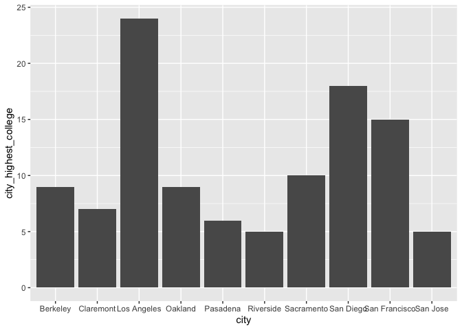
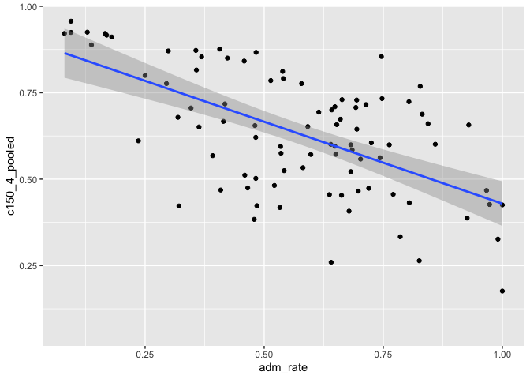
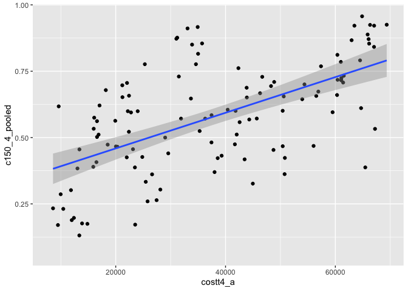
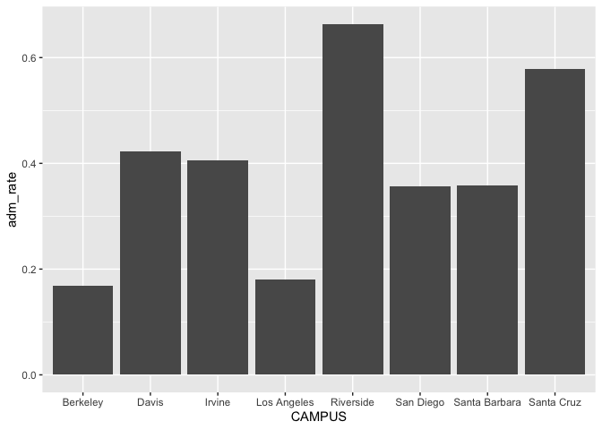
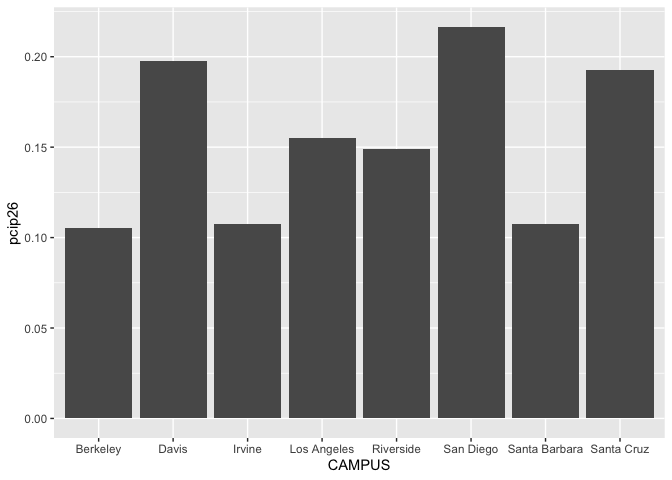

## Instructions
Answer the following questions and complete the exercises in RMarkdown. Please embed all of your code and push your final work to your repository. Your final lab report should be organized, clean, and run free from errors. Remember, you must remove the `#` for the included code chunks to run. Be sure to add your name to the author header above.  

Make sure to use the formatting conventions of RMarkdown to make your report neat and clean!  

## Load the libraries

```r
library(tidyverse)
library(janitor)
library(here)
library(naniar)
```

For this homework, we will take a departure from biological data and use data about California colleges. These data are a subset of the national college scorecard (https://collegescorecard.ed.gov/data/). Load the `ca_college_data.csv` as a new object called `colleges`.

```r
colleges <- read_csv("../lab10/data/ca_college_data.csv") %>% clean_names()
```

```
## Rows: 341 Columns: 10
## ── Column specification ────────────────────────────────────────────────────────
## Delimiter: ","
## chr (4): INSTNM, CITY, STABBR, ZIP
## dbl (6): ADM_RATE, SAT_AVG, PCIP26, COSTT4_A, C150_4_POOLED, PFTFTUG1_EF
## 
## ℹ Use `spec()` to retrieve the full column specification for this data.
## ℹ Specify the column types or set `show_col_types = FALSE` to quiet this message.
```

The variables are a bit hard to decipher, here is a key:  

INSTNM: Institution name  
CITY: California city  
STABBR: Location state  
ZIP: Zip code  
ADM_RATE: Admission rate  
SAT_AVG: SAT average score  
PCIP26: Percentage of degrees awarded in Biological And Biomedical Sciences  
COSTT4_A: Annual cost of attendance  
C150_4_POOLED: 4-year completion rate  
PFTFTUG1_EF: Percentage of undergraduate students who are first-time, full-time degree/certificate-seeking undergraduate students  

1. Use your preferred function(s) to have a look at the data and get an idea of its structure. Make sure you summarize NA's and determine whether or not the data are tidy. You may also consider dealing with any naming issues.

```r
colleges %>% 
  glimpse()
```

```
## Rows: 341
## Columns: 10
## $ instnm        <chr> "Grossmont College", "College of the Sequoias", "College…
## $ city          <chr> "El Cajon", "Visalia", "San Mateo", "Ventura", "Oxnard",…
## $ stabbr        <chr> "CA", "CA", "CA", "CA", "CA", "CA", "CA", "CA", "CA", "C…
## $ zip           <chr> "92020-1799", "93277-2214", "94402-3784", "93003-3872", …
## $ adm_rate      <dbl> NA, NA, NA, NA, NA, NA, NA, NA, NA, NA, NA, NA, NA, NA, …
## $ sat_avg       <dbl> NA, NA, NA, NA, NA, NA, NA, NA, NA, NA, NA, NA, NA, NA, …
## $ pcip26        <dbl> 0.0016, 0.0066, 0.0038, 0.0035, 0.0085, 0.0151, 0.0000, …
## $ costt4_a      <dbl> 7956, 8109, 8278, 8407, 8516, 8577, 8580, 9181, 9281, 93…
## $ c150_4_pooled <dbl> NA, NA, NA, NA, NA, NA, 0.2334, NA, NA, NA, NA, 0.1704, …
## $ pftftug1_ef   <dbl> 0.3546, 0.5413, 0.3567, 0.3824, 0.2753, 0.4286, 0.2307, …
```

```r
colleges
```

```
## # A tibble: 341 × 10
##    instnm      city  stabbr zip   adm_rate sat_avg pcip26 costt4_a c150_4_pooled
##    <chr>       <chr> <chr>  <chr>    <dbl>   <dbl>  <dbl>    <dbl>         <dbl>
##  1 Grossmont … El C… CA     9202…       NA      NA 0.0016     7956        NA    
##  2 College of… Visa… CA     9327…       NA      NA 0.0066     8109        NA    
##  3 College of… San … CA     9440…       NA      NA 0.0038     8278        NA    
##  4 Ventura Co… Vent… CA     9300…       NA      NA 0.0035     8407        NA    
##  5 Oxnard Col… Oxna… CA     9303…       NA      NA 0.0085     8516        NA    
##  6 Moorpark C… Moor… CA     9302…       NA      NA 0.0151     8577        NA    
##  7 Skyline Co… San … CA     9406…       NA      NA 0          8580         0.233
##  8 Glendale C… Glen… CA     9120…       NA      NA 0.002      9181        NA    
##  9 Citrus Col… Glen… CA     9174…       NA      NA 0.0021     9281        NA    
## 10 Fresno Cit… Fres… CA     93741       NA      NA 0.0324     9370        NA    
## # ℹ 331 more rows
## # ℹ 1 more variable: pftftug1_ef <dbl>
```

2. Which cities in California have the highest number of colleges?

```r
colleges %>%
  group_by(city) %>% 
  count(instnm) %>% 
  summarise(city_highest_college = sum(n)) %>% 
  arrange(city_highest_college, desc=T) %>% 
  tail(n= 10L)
```

```
## # A tibble: 10 × 2
##    city          city_highest_college
##    <chr>                        <int>
##  1 Riverside                        5
##  2 San Jose                         5
##  3 Pasadena                         6
##  4 Claremont                        7
##  5 Berkeley                         9
##  6 Oakland                          9
##  7 Sacramento                      10
##  8 San Francisco                   15
##  9 San Diego                       18
## 10 Los Angeles                     24
```

3. Based on your answer to #2, make a plot that shows the number of colleges in the top 10 cities.

```r
colleges %>%
  group_by(city) %>% 
  count(instnm) %>% 
  summarise(city_highest_college = sum(n)) %>% 
  arrange(city_highest_college, desc=T) %>% 
  tail(n= 10L) %>% 
  ggplot(aes(x=city, y=city_highest_college)) + geom_col()
```

<!-- -->

4. The column `COSTT4_A` is the annual cost of each institution. Which city has the highest average cost? Where is it located?

```r
colleges %>% 
  group_by(city) %>% 
  summarize(avgcollegecost = mean(costt4_a, na.rm = T)) %>% 
  filter(!avgcollegecost == "NaN") %>% 
  arrange(avgcollegecost) %>% 
  tail(n= 10)
```

```
## # A tibble: 10 × 2
##    city                avgcollegecost
##    <chr>                        <dbl>
##  1 La Verne                     50603
##  2 Rancho Palos Verdes          50758
##  3 Thousand Oaks                54373
##  4 Atherton                     56035
##  5 Moraga                       61095
##  6 Redlands                     61542
##  7 Orange                       64501
##  8 Valencia                     64686
##  9 Malibu                       66152
## 10 Claremont                    66498
```

5. Based on your answer to #4, make a plot that compares the cost of the individual colleges in the most expensive city. Bonus! Add UC Davis here to see how it compares :>).

```r
colleges %>% 
  filter(city == "Claremont" |  city == "Davis") %>% 
  filter(!costt4_a == "NA") %>% 
  ggplot(aes(x=instnm, y= costt4_a)) + geom_col() + coord_flip()
```

<!-- -->

6. The column `ADM_RATE` is the admissions rate by college and `C150_4_POOLED` is the four-year completion rate. Use a scatterplot to show the relationship between these two variables. What do you think this means?

```r
colleges %>% 
  ggplot(aes(x= adm_rate, y= c150_4_pooled)) + geom_point(na.rm = T) + geom_smooth(method = lm, se=T)
```

```
## `geom_smooth()` using formula = 'y ~ x'
```

```
## Warning: Removed 251 rows containing non-finite values (`stat_smooth()`).
```

<!-- -->
### I think this means that the higher the admission rate the lower the rate of graduation. On average people that go to higher admit rate school have a lower 4 year graduation rate. 
7. Is there a relationship between cost and four-year completion rate? (You don't need to do the stats, just produce a plot). What do you think this means?

```r
colleges %>% 
  ggplot(aes(x= costt4_a, y= c150_4_pooled)) + geom_point(na.rm = T) + geom_smooth(method = lm, se=T)
```

```
## `geom_smooth()` using formula = 'y ~ x'
```

```
## Warning: Removed 225 rows containing non-finite values (`stat_smooth()`).
```

<!-- -->
### I think this means that the higher the cost of attendence the more likely people are to graduate on time. 
8. The column titled `INSTNM` is the institution name. We are only interested in the University of California colleges. Make a new data frame that is restricted to UC institutions. You can remove `Hastings College of Law` and `UC San Francisco` as we are only interested in undergraduate institutions.

```r
ucsystem <- colleges %>% 
  filter(grepl("University of California", instnm), instnm != "University of California-Hastings College of Law" & instnm != "University of California-San Francisco") %>% 
  separate(instnm, into = c("UNIV", "CAMPUS"), sep = "-")
```

Remove `Hastings College of Law` and `UC San Francisco` and store the final data frame as a new object `univ_calif_final`.

Use `separate()` to separate institution name into two new columns "UNIV" and "CAMPUS".

9. The column `ADM_RATE` is the admissions rate by campus. Which UC has the lowest and highest admissions rates? Produce a numerical summary and an appropriate plot.

```r
ucsystem %>% 
  group_by(CAMPUS) %>% 
  ggplot(aes(x=CAMPUS, y=adm_rate)) + geom_col() 
```

<!-- -->
### Berkeley has lowest admit rate, Riverside has the highest.
10. If you wanted to get a degree in biological or biomedical sciences, which campus confers the majority of these degrees? Produce a numerical summary and an appropriate plot.

```r
ucsystem %>% 
  ggplot(aes(x= CAMPUS, y= pcip26)) + geom_col()### You should go to San Diego if you want a bio degree
```

<!-- -->

## Knit Your Output and Post to [GitHub](https://github.com/FRS417-DataScienceBiologists)
